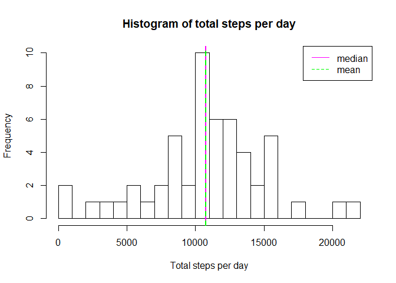
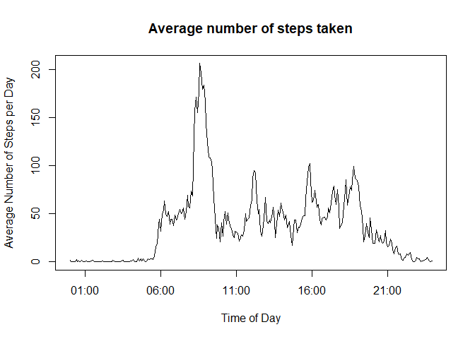
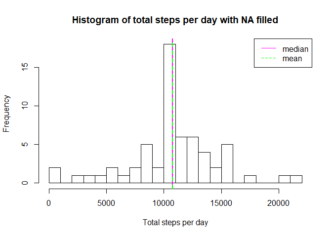
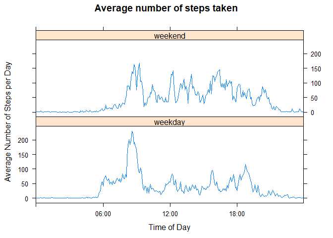

## Loading libraries required for running the code

```r
library(knitr)
library(lattice)
library(reshape2)
library(chron) 
```

## Setting up default so code is reproduced in markdown file


## Loading and preprocessing the data

```r
fileUrl <- "https://d396qusza40orc.cloudfront.net/repdata%2Fdata%2Factivity.zip"
download.file(fileUrl,destfile="activity.zip")
unzip("activity.zip")
activity <- read.csv("activity.csv")
activity$hour <- floor(activity$interval/100)
activity$minute <- activity$interval-activity$hour*100
activity$time <- paste(as.character(activity$hour),":",as.character(activity$minute),sep="")
activity$datetime <- as.POSIXct(paste(activity$date, activity$time, sep=" "), format="%Y-%m-%d %H:%M")
```
## What is mean total number of steps taken per day?
### The following code reports frequencies of number of steaps taken per day across the entire dataset and computes the median and mean total number of steps taken per day


```r
totalsteps <- tapply(activity$steps,activity$date,FUN=sum)
hist(totalsteps,breaks=20,xlab="Total steps per day",main="Histogram of total steps per day")
mediantotalsteps <- median(totalsteps,na.rm=TRUE)
meantotalsteps <- mean(totalsteps,na.rm=TRUE)
abline(v=mediantotalsteps,col="magenta",lwd=2,lty=1)
abline(v=meantotalsteps,col="green",lwd=2,lty=2)
legend("topright", c("median", "mean"), lty=c(1,2),col=c("magenta","green"))
```

<!-- -->

Median of the total number of steps taken per day = 10765.  
Mean of the total number of steps taken per day = 1.0766189\times 10^{4}

## What is the average daily activity pattern?
### The following code aims at checking whether there is a pattern in terms of average daily activity, e.g. at what time of day does the subject typically logs the most steps, and plots the results


```r
activity$intervaltime <- strftime(activity$datetime, format="%H:%M:%S")
totalstepsinterval <- tapply(activity$steps,activity$intervaltime,FUN=mean,na.rm=TRUE)
maximum <- names(totalstepsinterval[which(totalstepsinterval==max(totalstepsinterval))])
timesforplot <- as.POSIXct(names(totalstepsinterval), format="%H:%M:%S")
plot(timesforplot,totalstepsinterval,type="l",xlab="Time of Day", ylab="Average Number of Steps per Day",main="Average number of steps taken")
```

<!-- -->

The time interval at which the max average number of steps is taken is 08:35:00.

## Imputing missing values
### Calculate and report the total number of missing values in the dataset


```r
missingval <- sum(is.na(activity))
```
The number of missing values in the dataset is 2304.

### Assign mean number of steps value for that interval if data is missing


```r
activityfilled <- activity
for (i in 1:length(activityfilled$steps)) {
        if(is.na(activityfilled$steps[i])) {
                activityfilled$steps[i] <- totalstepsinterval[which(names(totalstepsinterval)==activityfilled$intervaltime[i])]
        }        
}
totalstepsfilled <- tapply(activityfilled$steps,activityfilled$date,FUN=sum)
hist(totalstepsfilled,breaks=20,xlab="Total steps per day",main="Histogram of total steps per day with NA filled")
mediantotalstepsfilled <- median(totalstepsfilled)
meantotalstepsfilled <- mean(totalstepsfilled)
abline(v=mediantotalstepsfilled,col="magenta",lwd=2,lty=1)
abline(v=meantotalstepsfilled,col="green",lwd=2,lty=2)
legend("topright", c("median", "mean"), lty=c(1,2),col=c("magenta","green"))
```

<!-- -->


Median of the total number of steps taken per day = 1.0766189\times 10^{4}.  
Mean of the total number of steps taken per day = 1.0766189\times 10^{4}

## Are there differences in activity patterns between weekdays and weekends?
### The following code aims at checking whether there is a difference in pattern in terms of average daily activity, depending on whether this is a weekend day or a weekday.


```r
##activityfilled$weekdayornot <- factor(c("weekend","weekday"))
weekendlist <- c("Saturday","Sunday")
for (i in 1:length(activityfilled$steps)) {
        if(weekdays(activityfilled$datetime[i]) %in% weekendlist) {
                activityfilled$weekdayornot[i] <- "weekend"
        }   
        else {
                activityfilled$weekdayornot[i] <- "weekday"
        }
        
}
meanstepsfilledwd <- tapply(activityfilled$steps,list(activity$intervaltime,activityfilled$weekdayornot),FUN=mean)
meanstepsfilledwd2 <- melt(meanstepsfilledwd)
meanstepsfilledwd2 <- transform(meanstepsfilledwd2,Var2 = factor(Var2))
meanstepsfilledwd2$Var1 <- as.POSIXct(names(meanstepsfilledwd[,1]), format="%H:%M")
meanstepsfilledwd2$Var1 <- times(strftime(meanstepsfilledwd2$Var1,"%H:%M:%S"))

xyplot(value ~ Var1 | Var2, data = meanstepsfilledwd2, layout=c(1,2),type="l",xlab="Time of Day",ylab="Average Number of Steps per Day",xlim=c(meanstepsfilledwd2$Var1[1],meanstepsfilledwd2$Var1[length(meanstepsfilledwd2$Var1)]),main="Average number of steps taken")
```

<!-- -->
